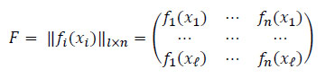
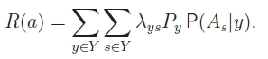

<!DOCTYPE html>
<html>
<head>
  <meta charset="utf-8">
  <base href="https://github.com/PavlyukovVladimir/SMPR/blob/master/"></base>
</head>
<body>
  
  # Классифицирующие алгоритмы
  ## Навигация
  <a href="#Vvonyye_opredeleniya">Вводные определения</a>
  ## Вводные определения 
  
Задано множество объектов X, и множество допустимых ответов Y, и существует целевая функция y*: X -> Y, значения которой yi = y*(xi) известны только на конечном подмножестве объектов {x1, …, xℓ} ⊂ X.

  
Пары «объект-ответ» (xi, yi) называются <i>прецедентами</i>. Совокупность пар 𝑋ℓ=(𝑥𝑖,𝑦𝑖)ℓ𝑖=1 называется <i>обучающей выборкой</i>.

  
Задача <i>обучения по прецедентам</i> заключается в том, чтобы по выборке 𝑋ℓ <i>восстановить зависимость</i> y*, то есть построить <i>решающую функцию</i> a: X -> Y, которая приближала бы целевую функцию y*(x), причем не только на объектах обучающей выборки, но и на всем множестве X.

  
Решающая функция a должна допускать эффективную компьютерную реализацию; по этой причине её называют <i>классифицирующим алгоритмом</i> .

  
<i>Признак f</i> объекта x – это результат измерения некоторой характеристики объекта. Формально признаком называется отображение <i>f</i>: X -> D<i>f</i>, где D<i>f</i> – множество допустимых значений признака. В частности, любой алгоритм a: X -> Y также можно рассматривать как признак.

  
Набор признаков <i>f</i>1,…, <i>f</i>n. Вектор (<i>f</i>1(x),…, <i>f</i>n(x)) называют <i>признаковым описанием</i> объекта x ∈ X. В дальнейшем будем полагать, что X = 𝐷<i>𝑓</i>1 × … × 𝐷<i>𝑓</i>𝑛.

  
Совокупность признаковых описаний всех объектов выборки записанная в виде таблицы размера ℓ × n, называют <i>матрицей объектов-признаков</i>:

  

  
<i>Моделью алгоритмов</i> называется параметрическое семейство отображений A = {g(x, <i>θ</i>) | <i>θ</i> ∈ <i>Θ</i>}, где g: X × <i>Θ</i> -> Y – некоторая фиксированная функция, <i>Θ</i> – множество допустимых значений параметра <i>θ</i>, называемое <i>пространством параметров</i> или <i>пространством поиска</i>.

  
Процесс подбора оптимального параметра модели <i>θ</i> по обучающей выборке 𝑋ℓ называют <i>настройкой</i> или <i>обучением</i> алгоритма a ∈ A.

  
<i>Метод обучения</i> – это отображение μ: (X × Y)ℓ -> A, которое произвольной конечной выборке 𝑋ℓ=(𝑥𝑖,𝑦𝑖)ℓ𝑖=1 ставит в соответствие некоторый алгоритм a ∈ A. Говорят также, что метод <i>строит</i> алгоритм a по выборке Xℓ.

  
<i>Функция потерь</i> – это неотрицательная функция ℒ(a, x), характеризующая величину ошибки алгоритма a на объекте x. Если ℒ(a, x) = 0, то ответ a(x) называется <i>корректным</i>.

  
<i>Функционал качества</i> алгоритма a на выборке 𝑋ℓ:
  

  

  

  

  

  

  

  

  

  

  

  

  

  

</body>
</html>
