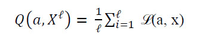
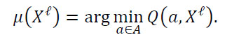

<!DOCTYPE html>
<html>
<head>
  <meta charset="utf-8">
  <base href="https://github.com/PavlyukovVladimir/SMPR/blob/master/"></base>
</head>
<body>
  
  # Классифицирующие алгоритмы
  ## Навигация
  
<a href="#Vvonyye_opredeleniya">Вводные определения</a>

  
<a href="#Metricheskiye_algoritmy">Метрические алгоритмы</a>

  
<a href="#a1NN">1NN</a>

  
<a href="#akNN">kNN</a>

  
  ## Вводные определения 
  
  
Задано множество объектов X, и множество допустимых ответов Y, и существует целевая функция y*: X -> Y, значения которой yi = y*(xi) известны только на конечном подмножестве объектов {x1, …, xℓ} ⊂ X.

  
Пары «объект-ответ» (xi, yi) называются <i>прецедентами</i>. Совокупность пар 𝑋ℓ=(𝑥𝑖,𝑦𝑖)ℓ𝑖=1 называется <i>обучающей выборкой</i>.

  
Задача <i>обучения по прецедентам</i> заключается в том, чтобы по выборке 𝑋ℓ <i>восстановить зависимость</i> y*, то есть построить <i>решающую функцию</i> a: X -> Y, которая приближала бы целевую функцию y*(x), причем не только на объектах обучающей выборки, но и на всем множестве X.

  
Решающая функция a должна допускать эффективную компьютерную реализацию; по этой причине её называют <i>классифицирующим алгоритмом</i> .

  
<i>Признак f</i> объекта x – это результат измерения некоторой характеристики объекта. Формально признаком называется отображение <i>f</i>: X -> D<i>f</i>, где D<i>f</i> – множество допустимых значений признака. В частности, любой алгоритм a: X -> Y также можно рассматривать как признак.

  
Набор признаков <i>f</i>1,…, <i>f</i>n. Вектор (<i>f</i>1(x),…, <i>f</i>n(x)) называют <i>признаковым описанием</i> объекта x ∈ X. В дальнейшем будем полагать, что X = 𝐷<i>𝑓</i>1 × … × 𝐷<i>𝑓</i>𝑛.

  
Совокупность признаковых описаний всех объектов выборки записанная в виде таблицы размера ℓ × n, называют <i>матрицей объектов-признаков</i>:

  

  
<i>Моделью алгоритмов</i> называется параметрическое семейство отображений A = {g(x, <i>θ</i>) | <i>θ</i> ∈ <i>Θ</i>}, где g: X × <i>Θ</i> -> Y – некоторая фиксированная функция, <i>Θ</i> – множество допустимых значений параметра <i>θ</i>, называемое <i>пространством параметров</i> или <i>пространством поиска</i>.

  
Процесс подбора оптимального параметра модели <i>θ</i> по обучающей выборке 𝑋ℓ называют <i>настройкой</i> или <i>обучением</i> алгоритма a ∈ A.

  
<i>Метод обучения</i> – это отображение μ: (X × Y)ℓ -> A, которое произвольной конечной выборке 𝑋ℓ=(𝑥𝑖,𝑦𝑖)ℓ𝑖=1 ставит в соответствие некоторый алгоритм a ∈ A. Говорят также, что метод <i>строит</i> алгоритм a по выборке Xℓ.

  
<i>Функция потерь</i> – это неотрицательная функция ℒ(a, x), характеризующая величину ошибки алгоритма a на объекте x. Если ℒ(a, x) = 0, то ответ a(x) называется <i>корректным</i>.

  
<i>Функционал качества</i> алгоритма a на выборке 𝑋ℓ:

  

  
Другие названия функционала качества – <i>функционал средних потерь</i> и <i>эмпирический риск</i>.

  
Если функция потерь принимает значения 1 – ошибочная классификация или 0 – корректная классификация, то функция потерь называется <i>бинарной</i> или <i>индикатором ошибки</i>, а функционал качества называется <i>частотой ошибок</i> алгоритма на выборке.

  
Часто используют:

  
ℒ(a, x) = |a(x) – y*(x)| - отклонение от правильного ответа; функционал качества тогда зовут – <i>средней ошибкой</i>.

  
ℒ(a, x) =(a(x) – y*(x))2 – квадратичная функция потерь; функционал качества – <i>среднеквадратичной ошибкой</i>.

  
Классический метод обучения, называемый <i>минимизацией эмпирического риска</i>, заключается в том, чтобы найти в заданной модели A алгоритм a, доставляющий минимальное значение функционалу качества <i>Q</i> на заданной обучающей выборке 𝑋ℓ:

  

  
  ## Метрические алгоритмы  
  
  ### 1NN  
  
  
<ol>
    <li>Подбирается метрика. В данной работе это декартово расстояние между векторами.</li>
    <li>Обучающая выборка сортируется в порядке увеличения расстояния от классифицируемого элемента.</li>
    <li>Элемент относят к тому классу к которому принадлежит ближайший (первый в отсортированной выборке) элемент.</li>
  </ol>

  
  ### kNN  
  
  
Алгоритм 1NN чувствителен к <i>выбросам</i>-случаям, когда 1 или несколько элементов одного класса оказываются среди элементов другого, устранить эти ситуации может алгоритм kNN.

  
Алгоритм kNN отличается от 1NN тем что он относит классифицируемый элемент не к классу ближайшего к нему элемента, а к классу чаще всего встречающемуся среди k ближайших элементов.

  
Посмотрим как они работают на выборке <a href="https://ru.wikipedia.org/wiki/Ирисы_Фишера"; target="_blank">ирисов фишера</a>.

  
Для иллюстрации методов, достаточно производить обучение и классификацию используя лишь 2 признака: «длинна лепестка» и «ширина лепестка».

  
Листинг скрипта на R:

<code>
#Павлюков В.В. 401и
 #source("script_1NN_kNN.R")
 #   Метрический алгоритм классификации с обучающей выборкой Xl использует
 #ВЕСОВУЮ ФУНКЦИЮ w(i,u), которая оценивает степень важности i-го соседа для классификации обьекта u и 
 #ОЦЕНКУ БЛИЗОСТИ( Гy(u,Xl) = sum([yui=y]w(i,u)) i меняется от 1 до l ) обьекта u к классу y
 #для того чтобы отнести классифицируемый обьект u к тому классу y,
 #для которого суммарный вес ближайших обучающих объектов(оценка близости) максимален.
 
 #алгоритм 1NN относит классифицируемый обьект к тому же классу, что и ближайший обьект выборки
 	#весовая функция равна единице на ближайшем элементе и равна нулю на остальных
 	#соответственно и оценка близости равна 1 на ближайшем соседе и равна нулю на всех остальных
 #алгоритм kNN относит классифицируемый обьект к тому же классу, к которому принадлежат большинство из k ближайших обьектов выборки
 	#весовая функция равна 1 на k ближайших соседях и 0 на остальных
 #оба алгоритма отнесут обьект к первому встретившемуся в выборке классу в случае одинакового расстояния(1NN)
 	или одинкового числа обьектов среди k соседей, принадлежащих разным классам(kNN)
 
 #Для классификации нужны:
 	#обучающая выборка
		Xl = iris#ирисы фишера: обучающая выборка
		N = c(1,3)#вектор признаков, содержит номера признаков учавствующих в обучении
		nomer_stolbtca_classov <- dim(Xl)[2]#номер столбца с названиями классов(в нашем случае последний 5-й)
 	#функция расстояния
		poschitat_rasstoyanie = function(t1, t2) {#функция расстояния, вычисляет евклидово расстояние между элементами,
			sqrt(sum((t1 - t2)^2))                  #как будто значения параметров являются координатами
		}
 	#метод сортировки
		otsortirovat_vyborky = function(klassyfitcyruyemyy_element,vyborka,vector_priznakov, po_ubyvaniyu = FALSE, funktciya_vesov = poschitat_rasstoyanie){
 		#возвращает отсортированную выборку по возрастанию(по умолчанию подставив TRUE отсортируем по убыванию) весов(расстояний) ее элементов относительно классифицируемого элемента
			dlinna_vyborki = dim(vyborka)[1]
			matritca_rasstoyaniy = matrix(0,dlinna_vyborki,2)#содержит нули,нужна для хранения весов выборки относительно u
			for (i in 1:dlinna_vyborki) {
				matritca_rasstoyaniy[i,] = c(funktciya_vesov(klassyfitcyruyemyy_element, vyborka[i,][vector_priznakov]), i)
			}
			vyborka[order(matritca_rasstoyaniy[,1],decreasing = po_ubyvaniyu),]
		}
 	#методы классификации:
		NN = function(klassyfitcyruyemyy_element,vyborka, vector_priznakov,nomer_stolbtca_classov,funktciya_rasstoyaniy=poschitat_rasstoyanie) {
			sortirovannaya_vyborka = otsortirovat_vyborky(klassyfitcyruyemyy_element,vyborka,vector_priznakov,FALSE,funktciya_rasstoyaniy)
			sortirovannaya_vyborka[1,nomer_stolbtca_classov]
		}
 
		kNN = function(klassyfitcyruyemyy_element,k,vyborka, vector_priznakov,nomer_stolbtca_classov,funktciya_rasstoyaniy=poschitat_rasstoyanie) {
			sortirovannaya_vyborka = otsortirovat_vyborky(klassyfitcyruyemyy_element,vyborka,vector_priznakov,FALSE,funktciya_rasstoyaniy)
			klassy = poluchit_klassy(vyborka,nomer_stolbtca_classov)
			blizost <- rep(0,times = length(klassy))
			names(blizost) <- klassy
			for (i in 1:k) {
				blizost[sortirovannaya_vyborka[i,nomer_stolbtca_classov]] <- (blizost[sortirovannaya_vyborka[i,nomer_stolbtca_classov]] + 1)
			}
			max = 1
			for (i in 1:length(blizost)) {
				if (blizost[max] < blizost[i]) {
				max <- i
				}
			}
			vyborka[vyborka$Species == klassy[max],][1,nomer_stolbtca_classov]#такие сложности для того, чтобы возвращался фрейм, а не строка
 													#klassy[max] вернет строку с названием наиболее часто встречающегося класса
 													#vyborka[vyborka$Species == klassy[max],] фрейм содержащий только 1 класс
 													#vyborka[vyborka$Species == klassy[max],][1,nomer_stolbtca_classov] фрейм содержащий название класса
		}
 #Визуализация:
	par(mfrow = c(2,1))#   Функция par() изменяет постоянные графические параметры,
 		#то есть последующие графики будут строиться относительно
 		#параметров, указанных пользователем.mfrow вектор формы c (nr, nc), который делит графическое окно
 		#как матрицу из nr строк и nc столбцов, графики тогда рисуются в строках
 
	poluchit_klassy = function(vyborka,nomer_stolbtca_classov){#если я прав, то обьединение вектора названий классов
 															   #с самим собой должно удалить одинаковые элементы
		union(vyborka[,nomer_stolbtca_classov],vyborka[,nomer_stolbtca_classov])
	}
	klassy <- poluchit_klassy(Xl,nomer_stolbtca_classov) #фрейм содержащий названия классов
 	
	dlinna_vyborki <- dim(Xl)[1]
 
	tcveta = topo.colors( length(klassy) )#создает вектор цветов
	points = rbind( #несколько точек для классификации
		c(5, 3),
		c(6.3, 5),
		c(8, 3.5),
		c(5, 2.5),
		c(7.5,2),
		c(6,5.25)
	)
 
 	# график 1NN
		plot(Xl[,N[1]], Xl[,N[2]], col = tcveta[Xl[,nomer_stolbtca_classov]], xlab = "", ylab = "",main = "1NN")
		for (i in 1:dim(points)[1]) {
			pt = points[i,]
			points(pt[1], pt[2], col = tcveta[NN(pt, Xl, N, nomer_stolbtca_classov )], pch = 15) 
		}
 
 	# график kNN
		plot(Xl[,N[1]], Xl[,N[2]], col = tcveta[Xl[,nomer_stolbtca_classov]], xlab = "", ylab = "",main = "kNN")
		for (i in 1:dim(points)[1]) {
			pt = points[i,]
			points(pt[1], pt[2], col = tcveta[kNN(pt, 7, Xl, N, nomer_stolbtca_classov )], pch = 15) 
	}
</code>

  

  

</body>
</html>
